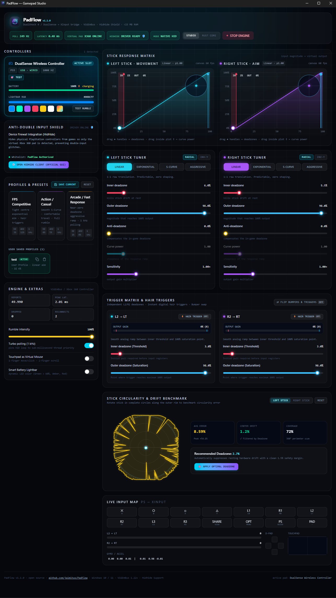

# 🎮 PadFlow — Next-Gen Gamepad Input Calibrator & ViGEmBus Bridge

[](https://github.com/jaimitus/PadFlow/releases)
[](./LICENSE)
[](https://buymeacoffee.com/jaimitus)

**PadFlow** is a native, ultra-lightweight gamepad calibration studio and virtual Xbox 360 controller emulator for **Windows 10 / 11**. Built from the ground up in **Rust** and **Tauri v2**, PadFlow bridges PlayStation 4 (DualShock 4) and PlayStation 5 (DualSense / Edge) controllers to XInput via **ViGEmBus** with sub-millisecond processing latency, zero bloat, and **integrated HidHide anti-double-input protection**.

---

## 📸 Interface Preview



---

## 🚀 What's New in v1.2.0 / Novedades de la Versión 1.2.0

- **🛡️ Shield Control Center:**
  - Per-controller **CLOAK / UNCLOAK** buttons right on every gamepad card, with a live **CLOAKED / VISIBLE** badge per pad.
  - Global shield **ON/OFF switch**, one-click **CLOAK ALL** / **UNCLOAK ALL**, and a live list of hidden devices with counter.
  - **Auto-cloak on connect** (new pads hide as they plug in) and **Cloak on startup** (already-connected pads hide at launch) — both persisted and toggleable.
  - **Tray integration:** cloak / uncloak all controllers straight from the system-tray icon, no need to open the window.
  - "CLOAK ALL" now only hides **PlayStation** pads — never touches Xbox controllers.
- **⚡ Live shield status:** the app now auto-refreshes HidHide state every 3 s, so edits made in the official HidHideClient GUI are reflected instantly.

---

### 📜 Version History

#### v1.1.1 — Automatic Update Detection via GitHub

- **⬆️ Automatic Update Detection via GitHub:**
  - New **"Check update"** button in the header plus a silent background check a few seconds after launch.
  - A notification popup appears automatically whenever a **new release is published on GitHub**, showing the release notes.
  - One-click **"Download & install"** with live progress bar, signature-verified signed updates and an automatic restart flow — or open the GitHub release page to grab the portable/installer manually.
- **🔑 Signed Update Pipeline:**
  - Fully configured `tauri-plugin-updater` with Ed25519-signed bundles (`latest.json` manifest published on every GitHub release).
  - "Check update" button always reports the exact state: checking / update available / up to date / error.

---

### 📜 Version History

#### v1.1.0 — Enhanced HidHide Cloak Firewall & Zero-Freeze HID Engine

- **🛡️ Enhanced HidHide Cloak Firewall:**
  - Direct low-level IOCTL communication (`\\.\HidHide`) and synchronized registry integration with the official Nefarius HidHide driver.
  - 1-Click global cloak toggle with real-time hidden instance count reporting.
  - Automatic whitelisting of PadFlow executable to prevent self-cloaking.
  - Direct **"Open Official HidHide Config"** launcher button to easily configure blacklists/whitelists in the official `HidHideClient.exe` GUI.
- **⚡ Zero-Freeze HID Engine & PnP Safety:**
  - Removed disruptive background PnP restarts, eliminating device detachments, thread stalls, and latency spikes.
  - Instantaneous, non-blocking start/stop lifecycle for the virtual Xbox 360 emulation pipeline.
- **🎮 Persistent Controller State & Real-Time Telemetry:**
  - Gamepad cards and live input feedback stay visible and responsive even when emulation is stopped.
  - Real-time 60 FPS stick coordinate tracing on the interactive HTML5 canvas.
  - Accurate battery levels, connection type indicators (USB / Bluetooth), sub-millisecond latency tracking, and polling rate counters.
- **🔧 Driver Setup & Diagnostic Helper:**
  - Automatic detection of ViGEmBus and HidHide driver installations with interactive 1-click download/install helpers for official signed installers.

---

## ✨ Key Features

- **⚡ Sub-Millisecond Realtime Engine:** Multi-threaded Rust HID engine running up to **1,000 Hz (1 kHz turbo polling)** with sub-millisecond input translation.
- **🛡️ HidHide Anti-Double-Input Shield:** Direct integration with the Nefarius **HidHide** driver to cloak physical PlayStation DirectInput devices from games so only the emulated XInput pad is detected, eliminating double-tap and ghost input glitches.
- **🎮 100% Real PlayStation HID Support:** Direct USB and Bluetooth HID parsing for DualShock 4 (`0x054C:0x05C4`, `0x09CC`) and DualSense / DualSense Edge (`0x054C:0x0CE6`, `0x0DF2`).
- **📈 Dynamic Stick Response Curve Tuner:** Live 60 FPS interactive HTML5 canvas for visual curve shaping:
  - **Linear:** Predictable 1:1 raw translation.
  - **Exponential:** Micro-precision near deadzone center, rapid flick response at outer rim.
  - **S-Curve:** Smoothstep mathematical curve for balanced precision and speed.
  - **Aggressive:** Inverse-exponential instant ramp for arcade and fast-paced competitive titles.
- **🎯 Inner, Outer & Anti-Deadzone Calibration:** Independent radial or axis-aligned deadzone configuration per stick.
- **💡 Lightbar & Rumble Haptics:** Custom RGB lightbar color assignment and rumble intensity shaping.
- **💾 Custom User Profile Manager:** Save, load, export (copy JSON to clipboard), and delete personalized curves locally.
- **🛡️ Shield Control Center:** per-controller cloak toggles, global shield switch, CLOAK ALL / UNCLOAK ALL, hidden-device list, auto-cloak on connect & on startup, plus tray controls.
- **⬆️ Built-in Auto-Update:** Automatic GitHub release detection with one-click signed in-app updates and release-note preview.
- **🚀 Automated ViGEmBus & HidHide Integration:** Detects driver presence automatically with interactive 1-click installer support and official client launching.
- **🪶 Ultra-Lightweight Footprint:** Consumes **< 15 MB RAM**, zero background bloat, no account required, 100% telemetry-free.

---

## 📊 Feature Matrix: PadFlow vs Competition

| Feature / Metric | ⚡ PadFlow | 🎮 DS4Windows | 🕹️ reWASD | 💨 Steam Input | 🔮 DualSenseX |
| :--- | :---: | :---: | :---: | :---: | :---: |
| **RAM Usage** | **< 15 MB** | ~60 - 120 MB | ~150 - 250 MB | ~200 - 400 MB | ~80 - 150 MB |
| **Backend Core** | **Rust + Tauri v2** | C# / .NET | C++ Closed | C++ Embedded | C# / Electron |
| **Anti-Double-Input (HidHide)** | **Integrated (1-click)** | Manual / Plugin | Proprietary | N/A | Limited |
| **Interactive Curve Canvas** | **Yes (Real-time 60 FPS)** | Basic Preset | Paid Feature | Basic Sliders | Basic Sliders |
| **1 kHz Turbo Polling** | **Native** | Configurable | Configurable | Driver Dependent | Limited |
| **Privacy / Telemetry** | **0% (100% Offline)** | 100% Offline | Online Checks | Steam Telemetry | Offline |
| **Price / License** | **Free (MIT)** | Free (Open) | Paid License | Bundled with Steam | Paid / Freemium |
| **Custom Saved Profiles** | **Yes + JSON Export** | Yes | Yes (Paid) | Cloud Sync | Yes |
| **Portable Executable** | **Yes (Standalone)** | Zip Extraction | No (Install Only) | No | Limited |

---

## 📥 Download & Installation

Download the latest release from [Releases](https://github.com/jaimitus/PadFlow/releases):

1. **`PadFlow-Portable.exe`** — Single standalone executable. No installation required.
2. **`PadFlow_1.2.0_x64-setup.exe`** — Recommended Windows installer with start menu shortcuts and bundled driver setup.
3. **`PadFlow_1.2.0_x64_en-US.msi`** — Standard MSI installer package for enterprise / automated deployment.

> **Note:** PadFlow requires the **ViGEmBus driver** (`v1.22.0+`) for virtual Xbox 360 controller emulation, and supports the **HidHide driver** for anti-double-input device cloaking. If missing, PadFlow provides interactive 1-click in-app installer launchers for both official signed drivers.

---

## 🛠️ Building from Source

### Prerequisites
- [Node.js](https://nodejs.org/) (v18+)
- [Rust toolchain](https://www.rust-lang.org/) (MSVC `x86_64-pc-windows-msvc`)
- [Tauri v2 CLI](https://tauri.app/)

### Build Commands

```bash
# 1. Clone the repository
git clone https://github.com/jaimitus/PadFlow.git
cd PadFlow

# 2. Install dependencies
npm install

# 3. Run in development mode
npx tauri dev

# 4. Build production binaries (NSIS setup, MSI, updater artifacts & Portable)
npm run tauri build
```

> **Note (update signing):** production builds sign the update bundles, so they
> require the updater keys. Generate them once (`npx tauri signer generate -w ~/.padflow/padflow-updater.key`)
> and export the two environment variables before building:
>
> ```bash
> export TAURI_SIGNING_PRIVATE_KEY_PATH="$HOME/.padflow/padflow-updater.key"
> export TAURI_SIGNING_PRIVATE_KEY_PASSWORD="your-key-password"
> ```
>
> The updater fetches the update manifest from
> `https://github.com/jaimitus/PadFlow/releases/latest/download/latest.json`,
> which is published automatically as part of every release.

---

## 📜 License

This project is licensed under the **MIT License** — see the [LICENSE](./LICENSE) file for details.

Developed with ❤️ by [jaimitus](https://github.com/jaimitus). If you find PadFlow useful, consider supporting development:

[](https://buymeacoffee.com/jaimitus)
